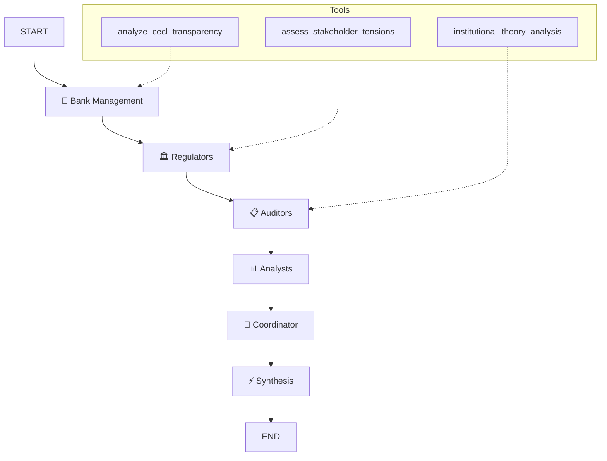

# CECLAgents

To investigate the dynamics surrounding CECL operational transparency, we adopt an agentic framework rooted in institutional and organizational theory, operationalized through a multi-agent simulation. In this framework, key stakeholders—bank management, regulators, auditors, and financial analysts—are modeled as autonomous agents with distinct objectives and behavioral rules. Bank agents determine CECL estimates and disclosure levels, balancing proprietary concerns and stakeholder trust. Regulators and auditors evaluate transparency and compliance, issuing feedback that influences bank behavior in future cycles. Analysts respond by adjusting market confidence and risk assessment. Agent configurations are defined by role-specific decision heuristics and feedback sensitivity. Using LangGraph as the simulation infrastructure, we enable structured, iterative interactions among agents to trace how transparency strategies evolve over time and under varying institutional pressures. This approach allows us to analyze how operational transparency reduces stakeholder tension and fosters legitimacy across reporting environments.

# CECL Multi‑Agent Transparency Simulation Framework

> **Multi‑Agent Simulation Framework for CECL Operational Transparency**

This repository provides a reproducible **LangGraph**/**LangChain**‑based multi‑agent simulation platform for studying how transparency in Current Expected Credit Losses (CECL) estimation evolves among banks, regulators, auditors, and financial analysts. The framework is grounded in **institutional theory** and organizational research, enabling scholars and practitioners to quantify transparency, analyse stakeholder tensions, and design feedback loops that foster legitimacy.

---

## 📦 Table of Contents

- [CECLAgents](#ceclagents)
- [CECL Multi‑Agent Transparency Simulation Framework](#cecl-multiagent-transparency-simulation-framework)
  - [📦 Table of Contents](#-table-of-contents)
  - [Overview](#overview)
  - [Dependencies](#dependencies)
  - [Quick Start](#quickstart)
  - [Core Components](#corecomponents)
    - [Agent Roles](#agentroles)
    - [Analysis Tools](#analysistools)
    - [Workflow](#workflow)
  - [Visualisation](#visualisation)
  - [Example Output](#exampleoutput)
  - [Research Applications](#researchapplications)
  - [Contributing](#contributing)
  - [License](#license)

---

## Overview



**Research Objectives**

1. **Quantify** CECL transparency levels and their evolution over time.
2. **Explore** how coercive, mimetic, and normative pressures shape disclosure strategies.
3. **Evaluate** feedback mechanisms that alleviate stakeholder tensions and enhance legitimacy.

---

## Dependencies

| Package                  | Suggested Version | Purpose                                |
| ------------------------ | ----------------- | -------------------------------------- |
| Python                   | ≥ 3.10            | Interpreter                            |
| `langgraph`              | latest            | State‑graph orchestration              |
| `langchain‑anthropic`    | latest            | Claude‑3 API wrapper                   |
| `python‑dotenv`          | ≥ 1.0             | Environment variable loading           |
| `asyncio`, `dataclasses` | built‑in          | Asynchronous support & data structures |

> **Note:** Set `ANTHROPIC_API_KEY` in your `.env` file or as an environment variable before running the simulation.

---

## Quick Start

```bash
# 1. Clone the repository
$ git clone https://github.com/yourname/cecl-multiagent.git && cd cecl-multiagent

# 2. Create a virtual environment and install dependencies
$ python -m venv .venv && source .venv/bin/activate
$ pip install -r requirements.txt

# 3. Configure your API key
$ echo "ANTHROPIC_API_KEY=sk-..." >> .env

# 4. Run the example simulation
$ python cecl_simulation.py
```

The script prints research questions, the methodological framework, and key insights to the console, and saves detailed results to `simulation_results.json` (file path can be customised).

---

## Core Components

### Agent Roles

| Agent Class               | Key Responsibilities                                                                          |
| ------------------------- | --------------------------------------------------------------------------------------------- |
| **BankManagementAgent**   | Formulates CECL disclosure strategies; balances regulatory pressure and competitive advantage |
| **RegulatoryAgent**       | Evaluates compliance and applies transparency requirements                                    |
| **AuditorAgent**          | Assesses model reliability, audit trails, and validation evidence                             |
| **AnalystAgent**          | Adjusts market confidence and earnings forecasts based on disclosure quality                  |
| **SimulationCoordinator** | Orchestrates multi‑round interactions and synthesises findings                                |

### Analysis Tools

1. **`analyze_cecl_transparency`** — Scores CECL transparency and highlights contributing factors or gaps.
2. **`assess_stakeholder_tensions`** — Quantifies tension levels among different stakeholder groups.
3. **`institutional_theory_analysis`** — Tags coercive, mimetic, and normative pressures; identifies change patterns.

### Workflow

1. **Bank → Regulator → Auditor → Analyst:** Sequential evaluation by the four primary stakeholder agents.
2. **Coordinator:** Consolidates intermediate states, formulates research questions and methodology.
3. **Synthesis:** Generates the final research proposal and key insights.
4. **MemorySaver:** Persists `ResearchState` across nodes for checkpointing.

---

## Visualisation

* Run `create_workflow_diagram()` to export the Mermaid flow diagram shown above.
* Execute `visualize_workflow_structure()` to print a detailed node list and execution order in the terminal.

---

## Example Output

```text
=== CECL Multi‑Agent Simulation Results ===
Research Questions: [...]
Methodology Framework: Multi‑agent simulation with institutional theory foundation
Key Insights:
  • Opacity stems from undocumented processes and proprietary concerns
  • Stakeholder tensions vary with information needs
  • Institutional pressures both drive and inhibit transparency
  • An operational transparency framework can significantly reduce tensions
```

---

## Research Applications

* **Academia:** Institutional theory, organisational transparency, and financial regulation studies.
* **Industry:** Enhancing bank CECL disclosure processes; optimising communication with regulators and auditors.
* **Policy:** Designing tiered transparency guidelines that balance information sufficiency and compliance costs.

---

## Contributing

We welcome issues and pull requests!

1. Fork → create a feature branch → commit → open a PR.
2. Include a clear description and supporting experiments in every PR.
3. Run `ruff` and `black` formatting checks before submission.

---

## License

This project is licensed under the **MIT License**. See the `LICENSE` file for details.
